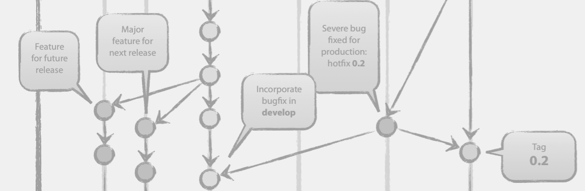
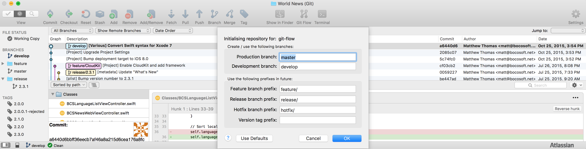

**CSCI 5828: Foundations of Software Engineering**  
*Fall 2015, Professor Kenneth Anderson*

Student: **Matthew Thomas**  
Presentation 3  

# Topics in Software Configuration Management  

Configuration Management is an important part of Software Engineering, and consists of many topics including source code management, build management, versioning and release management. This presentation will cover tools that help in these processes, and how they can applied in the context of mobile development.

Source code management
Build engineering
Environment configurations
Change control
Release engineering
Deployment

##Gitflow Branching Model  

  

The Gitflow branching model was designed by [Vincent Driessen](http://nvie.com) and presented in his 2010 article ["successful Git branching model"](http://nvie.com/posts/a-successful-git-branching-model/). The article and Gitflow exploded in popularity and is now well-known and loved within the Git community.  

As the name suggests, Gitflow was created for use with the [Git source control management](https://git-scm.com) system. Gitflow could in theory be applied to most other forms of source control management. [Mercurial SCM](https://www.mercurial-scm.org) adapted an equivalent branching model called [Hg Flow](https://andy.mehalick.com/2011/12/24/an-introduction-to-hgflow/). However since Gitflow depends heavily on quick and lightweight branching so the cost of implementing Gitflow on another SCM would increase depending on how easy it is to branch.  

###Tools  

As with Git, Gitflow can be implemented entirely from the command-line or via a user-interface. Here are two of the tools to bootstrap your Gitflow process.  

####Git Extensions  

Vincent Driessen also created a set of Git Extensions "to provide high-level repository operations" for Gitflow. These extensions can be found as an [open-source project on Github](https://github.com/nvie/gitflow) now supported by over 30 contributors.  

####SourceTree  

If you prefer to use a Graphical User-Interface (GUI), then [SourceTree](https://www.sourcetreeapp.com) is a good free option for OS X. It comes with [out-of-the-box support for both Gitflow and Hg Flow](http://blog.sourcetreeapp.com/2012/08/01/smart-branching-with-sourcetree-and-git-flow/).  

  

###Usage  

###Master Branch  

After a release is deployed from either a release branch or a hotfix branch, the last commit should be merged into the master branch. Developers should never make direct commits on the master branch, rather each commit should result only from the merged from either a release or hotfix branch. After the merge, the merge-commit on the master branch is tagged with the version number using Semantic Versioning (see below).  

The master branch is a great way to be able to track and visualize the release history of a product in a single branch. The master branch also makes it easy to checkout the version of the code for a specific release.  

###Develop Branch  

In other branching models, this would be equivalent to 'trunk'.

###Feature Branches  

*May branch off from: develop*  
*Must merge back into: develop*  
*Branch naming convention: feature/**  

New features should be developed on separate branches that spawn from the develop branch. These branches normally only reside on an individual developer's machine, but can be either shared with other developer's or pushed to the central repository if multiple developers are working on the same feature.  

After a feature is branched from develop and meanwhile a feature is being developed, other work will be being completed on the develop branch. Therefore in order to proactively resolve merge conflicts with the develop branch and harden the feature by integration testing, it is important to perform merges from the develop branch into the feature branch from time to time, especially if the feature branch in question is long-running. If the feature is a short branch, it is still a good idea to perform one reverse merge from develop to the feature branch before merging feature back into develop. In this way, smoke testing can  be performed on the isolated feature branch to make sure the feature development has not broken anything on the develop branch. When testing is complete, the feature can be merged without any conflicts back into the develop branch.  

A powerful benefit of keeping feature development on separate branches, is the ability to elevate the Agile value of flexibility over following a plan. When a release branch is created, only those features that have been merged into develop will be included into the release. That way, there will not be any unfinished feature work holding up the release. The develop branch will always be ready for a release branch to be created.  

###Release Branches  

*May branch off from: develop*  
*Must merge back into: develop and master*  
*Branch naming convention: release/X.Y.Z*  

Gitflow works best on an Agile team where releases and versioning are flexible and value is placed on "responding to change over following a plan". In Gitflow, releases are not assigned a version (e.g. X.Y.Z) until code-complete. This flows well with teams who think about a release in terms of the new features or bug fixes that the release comprised of, rather than teams that commonly talk about releases more abstractly by their version. As [Kent Beck](https://en.wikipedia.org/wiki/Kent_Beck) creator of Extreme Programming (XP) recommends, Agile teams should think about releases in terms of "themes", functionality for each release that has been specified at a high level. This also encourages all product members, not just developers, to be more aware of the current features in development. It's easy to get out-of-touch with a product, its features, and the value being delivered to users when the team depends too heavily on version numbers. Additionally, when version numbers change, like in the case of hot-fixes, a team that depends on version numbers will have to scramble to readjust their release plan whereas a team using release themes will not be affected.  

###Hot-fix Branches  

*May branch off from: master*  
*Must merge back into: master*  
*Branch naming convention: hotfix/X.Y.Z*  

I talked earlier about thinking about releases in terms of "themes" instead of versions. Hot-fixes are one reason why this might be important.

###Tagging  

###Strategies for Apple App Store Updates  

###References  

[A successful Git branching model](http://nvie.com/posts/a-successful-git-branching-model/)  
[A short introduction to Git Flow (Video)](https://vimeo.com/16018419)  
[Using git-flow to automate your git branching workflow](http://jeffkreeftmeijer.com/2010/why-arent-you-using-git-flow/)  

##Semantic Versioning  

  

###Major  

###Minor  

###Patch  

###Pre-Release  

###References  
[http://semver.org](http://semver.org)  

##Fastlane.tools  
