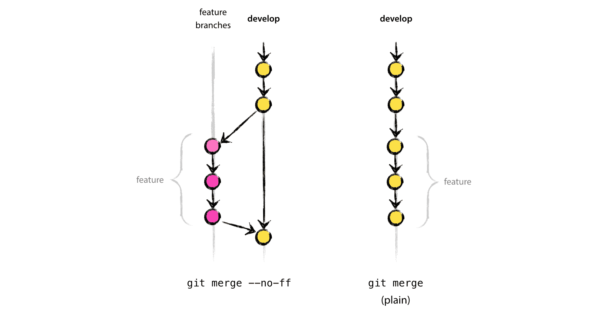

#Gitflow Branching Model  

  

The Gitflow branching model was designed by [Vincent Driessen](http://nvie.com) and presented in his 2010 article ["successful Git branching model"](http://nvie.com/posts/a-successful-git-branching-model/). The article and Gitflow exploded in popularity and is now well-known and loved within the Git community.  

As the name suggests, Gitflow was created for use with the [Git source control management](https://git-scm.com) system. Gitflow could in theory be applied to most other forms of source control management. [Mercurial SCM](https://www.mercurial-scm.org) adapted an equivalent branching model called [Hg Flow](https://andy.mehalick.com/2011/12/24/an-introduction-to-hgflow/). However since Gitflow depends heavily on quick and lightweight branching so the cost of implementing Gitflow on another SCM would increase depending on how easy it is to branch.  

Developers who are accustomed to having a Configuration Management team in charge of the repository and branching are likely to find Git and Gitflow daunting, in part because branching is still viewed as a cumbersome and heavy process. Git branches are simply lightweight movable pointers in the repository, and they are quick to create and quick to be destroyed with no lasting consequences on the code-base. If a developer thinks that Gitflow is thus too complicated and overkill for a project, it's likely they need more exposure to Git and Gitflow documentation.  

##Tools  

As with Git, Gitflow can be implemented entirely from the command-line or via a user-interface. Here are two of the tools to bootstrap your Gitflow process.  

####Git Extensions  

Vincent Driessen also created a set of Git Extensions "to provide high-level repository operations" for Gitflow. These extensions can be found as an [open-source project on Github](https://github.com/nvie/gitflow) now supported by over 30 contributors.  

You do **not need** to install these extensions in order to implement Gitflow. The extensions are merely short-cuts to help streamline your Gitflow workflow.  

####SourceTree  

If you prefer to use a Graphical User-Interface (GUI), then [SourceTree](https://www.sourcetreeapp.com) is a good free option for OS X. It comes with [out-of-the-box support for both Gitflow and Hg Flow](http://blog.sourcetreeapp.com/2012/08/01/smart-branching-with-sourcetree-and-git-flow/).  

  

##Usage  

The branches below describe the standard practices and naming conventions, although branches may be given different names if it's more clear for a team. For example, a team might call the develop branch 'trunk', or the master branch 'app-store'. Both the master and develop branches are permanent branches in the repository, while the supporting branches, features, releases, and hotfixes, are temporary branches that come and go according to need. All branches and their names do not carry any special meaning other than *how* we use them; Gitflow branches are all equal lightweight pointers.  

Gitflow lays out specific rules surrounding when and how each of the supporting branches can be created, merged, and destroyed.  

Make sure to turn off fast-forward merging in your repository settings or specify the --no-ff flag each time you merge a branch. This setting ensures that a merge-commit is always created. This is useful for example when a supporting branch, like a feature, is created and merged back into develop before any commits occur on develop. With fast-forwarding, the develop HEAD pointer would simply move to where the feature is pointing, thereby loosing the record of any existance of a feature branch. The feature commits would still be seen, but it would appear as if they happened directly on the develop branch. Below is a diagram from Driessen's blog post:  

  

##Master Branch  

After a release is deployed from either a release branch or a hotfix branch, the last commit should be merged into the master branch. Developers should never make direct commits on the master branch, rather each commit should result only from the merged from either a release or hotfix branch. After the merge, the merge-commit on the master branch is tagged with the version number using Semantic Versioning (see below).  

The master branch is a great way to be able to track and visualize the release history of a product in a single branch. The master branch also makes it easy to checkout the version of the code for a specific release.  

##Develop Branch  

In other branching models, this branch would be called the ['trunk'](https://en.wikipedia.org/wiki/Trunk_(software)), or 'main'. This is where the 'churn' happens, and contains the most up-to-date, though unstable, version of the code.  

A continuous integration job should be created to point to this branch, and should be built either with each commit or with a short time-interval such that QA can also have access to the latest build on this branch.

##Feature Branches  

*May branch off from: develop*  
*Must merge back into: develop*  
*Branch naming convention: feature/**  

New features should be developed on separate branches that spawn from the develop branch. These branches normally only reside on an individual developer's machine, but can be either shared with other developer's or pushed to the central repository if multiple developers are working on the same feature.  

After a feature is branched from develop and meanwhile a feature is being developed, other work will be being completed on the develop branch. Therefore in order to proactively resolve merge conflicts with the develop branch and harden the feature by integration testing, it is important to perform merges from the develop branch into the feature branch from time to time, especially if the feature branch in question is long-running. This concept is called 'Forward integration'. If the feature is a short branch, it is still a good idea to perform one reverse merge from develop to the feature branch before merging feature back into develop. In this way, smoke testing can  be performed on the isolated feature branch to make sure the feature development has not broken anything on the develop branch. When testing is complete, the feature can be merged without any conflicts back into the develop branch.  

A powerful benefit of keeping feature development on separate branches, is the ability to elevate the Agile value of flexibility over following a plan. When a release branch is created, only those features that have been merged into develop will be included into the release. That way, there will not be any unfinished feature work holding up the release. The develop branch will always be ready for a release branch to be created.  

If the branch is long-running, then a continuous integration job can be created to point to the feature branch so that QA can proactively work with developers to solidify the feature before merging into develop. Once a feature branch is merged back into the develop branch, it should be deleted.  

##Release Branches  

*May branch off from: develop*  
*Must merge back into: develop and master*  
*Branch naming convention: release/X.Y.Z*  

Gitflow works best on an Agile team where releases and versioning are flexible and value is placed on "responding to change over following a plan". In Gitflow, releases are not assigned a version (e.g. X.Y.Z) until code-complete. This flows well with teams who think about a release in terms of the new features or bug fixes that the release comprised of, rather than teams that commonly talk about releases more abstractly by their version. As [Kent Beck](https://en.wikipedia.org/wiki/Kent_Beck) creator of Extreme Programming (XP) recommends, Agile teams should think about releases in terms of "themes", functionality for each release that has been specified at a high level. This also encourages all product members, not just developers, to be more aware of the current features in development. It's easy to get out-of-touch with a product, its features, and the value being delivered to users when the team depends too heavily on version numbers. Additionally, when version numbers change, like in the case of hotfixes, a team that depends on version numbers will have to scramble to readjust their release plan whereas a team using release themes will not be affected.  

A separate continuous integration job should be created for each release branch so that QA can test changes made before deployment. Once a release branch is merged back into the develop branch and the master branch, the release branch should be deleted. As usual, this will not delete the commits that made up the release branch, but rather only the lightweight pointer that pointed to the head of the release branch, which is no longer needed since no more changes should be committed to the release branch.  

##Hotfix Branches  

*May branch off from: master*  
*Must merge back into: master and (release or develop)*  
*Branch naming convention: hotfix/X.Y.Z*  

I talked earlier about thinking about releases in terms of "themes" instead of versions. Hotfixes are one reason why this might be important. Hotfixes are unplanned and urgent changes that do not fit into the scheduled release plan, therefore they would disrupt and offset any planned versions. An obvious resolution for this would be to add a hotfix component to the version number; i.e. Major.Minor.Patch.*Hotfix* however this would break from the Semantic Versioning standard practices.  

The process for a hotfix is as follows:  
1. Client reports critical and urgent issue.  
2. Hotfix branch created from the master branch.  
3. One or two commits are created on the new hotfix branch.  
4. QA tests the commits from builds pointing directly at the hotfix branch.  
5. Development and testing are complete, so deploy latest hotfix commit.  
*After successful deployment...*  
6. Merge hotfix branch into master branch, and tag commit on master branch with version number.  
7a. If a release is in progress, merge hotfix into release branch.  
7b. Else, merge hotfix branch into develop branch.  

A separate continuous integration job should be created for each release branch so that QA can test changes made before deployment. Just like with feature and release branches, once a hotfix branch is merged back into master and developer (or release), the hotfix branch should be deleted.  

##Tagging  

Tagging should be used to identify release versions on the master branch and should use the Semantic Versioning conventions. Tagging can also be used to mark an early-adopter build that was sent to the client from the develop branch or a feature branch.  

##Strategies for App Store Updates  

Both the Apple App Store and Google Play stores now use a review process to vet app updates for security concerns, UI/UX convention violations, and stability. It is recommended not to merge from release or hotfix into the master branch until the release or hotfix is approved. However, in order to keep the develop branch up-to-date meanwhile the release is going through the review process, the release or hotfix branch can be merged back into develop even before the review takes place. That way, the repository will also contain a record of how many times a given release or hotfix was submitted for review before it was approved.  

##Strategies for Git Submodules

There is no official stance on the use of [Git submodules](https://git-scm.com/docs/git-submodule) and how to apply Gitflow to Git Submodules. For a Git submodule that is only consumed, it is straight-forward to point a feature branch or develop branch to the latest version of the Git submodule, and have that pointer cascade to the releases. However if a Git Submodule is being both consumed and produced, then branching becomes trickier. From my own experience, here are my recommendations:  
1. Don't use a master branch unless the git submodule is a versioned library consumed by other products.  
2. There is no need to tag the parent repository versions inside of the git submodule dependency. The tagged commits in the parent repository will by nature point to the correct commits in the submodules.  
3. Branch only when necessary; if a release is created in the parent repository, then a release branch only needs to be created in each Git submodule if changes need to be committed in the Git submodule on a release branch.  
4. Otherwise, branching in Git submodules should mirror branching in the parent repository with one exception. Branches should be prefixed with the name of the product that created the branch. E.g. MyApp/featureX branches from develop  
5. Share the develop branch between products, so there is no need to keep multiple develop branches in sync. Otherwise you run the risk of ending up with two versions of the same library within a single repository.  

##References  

[A successful Git branching model](http://nvie.com/posts/a-successful-git-branching-model/)  
[A short introduction to Git Flow (Video)](https://vimeo.com/16018419)  
[Using git-flow to automate your git branching workflow](http://jeffkreeftmeijer.com/2010/why-arent-you-using-git-flow/)  
