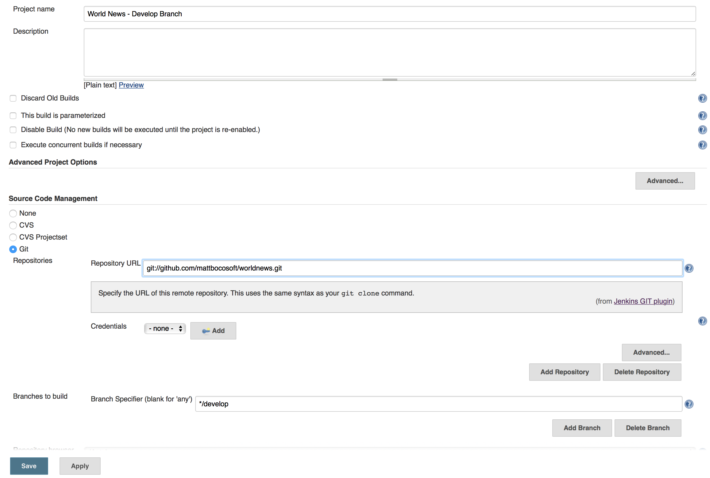

#Continuous Integration for Gitflow and Semver  

Now that your project has been setup with a branching model and a versioning system, the next topic deals with automatically building and distributing the different branches and versions to team members. The sooner that quality engineers (QA), business analysts (BA) and product managers (PM) can get their hands on the latest version of the software, the faster that developers can get feedback on their work. [Continuous Integration](https://en.wikipedia.org/wiki/Continuous_integration) is a process that fulfills this need.  

There are many Continuous Integration options available on the market but this presentation will focus on [Jenkins](https://jenkins-ci.org), a powerful and time-tested Continuous Integration system [very popular](https://wiki.jenkins-ci.org/pages/viewpage.action?pageId=58001258) in the Software Engineering industry and the open-source community.  

The project has been around since 2004 when it was developed by Sun Microsystems under the name Hudson and by way of a trademark dispute became known to the open-source community as Jenkins.  

###Set-up  
The easiest way to install Jenkins is by downloading and running one of the native packages available on the [Jenkins homepage](https://jenkins-ci.org). Once the installation is complete, open [localhost:8080/](http://localhost:8080/) in the computer's internet browser to access Jenkins.  

Out-of-the-box Jenkins only supports Subversion and CVS so the next step is setting up integrating with Git. Luckily, Jenkins is extensible via a extensive plugin-library, so there is a plugin for adding [support for Git SCM](https://wiki.jenkins-ci.org/display/JENKINS/Git+Plugin).  
1. Click "Manage Jenkins" on the left-hand menu  
2. Click "Manage Plugins" in the list  
3. Click on the "Available" tab  
4. Use the filter in the top-right corner to search for "git"  
5. Scroll down until "GIT plugin" and check the box to the left of the item  
6. Click "Install without restart" button on the bottom of the page  

Now you are ready to start creating jobs for your Gitflow branches and Semantically-Versioned builds.  

###Jenkins Jobs  
A 'job' in Jenkins is the basic unit of continuous integration. A job can be used to build and/or merge multiple branches simultaneously.  

#####Create a job  
To create a new job:  
1. Click on "New Item" in the top left corner of the main Jenkins page.  
2. Type in the job name  
3. Select "Freestyle project"  
4. Click 'OK'  

  

#####Configure a job  
To configure an existing job:  
1. Click on the job in the main job list  
2. Click on "Configure" in the left-hand menu  
3. Click on "Git" under the 'Source Code Management' list  
4. Type in the address of the Git repository (local or remote)  
5. Use the 'Build Triggers' section to define how often to build the branch.  
6. If you need help with any parameter, click the question-mark icon to the right of the field  

  

###Gitflow: Permanent Branches  

####Develop  
The most active and important job will point to the develop branch, where most of the commits occur. This job can be used to ensure that all team members, not just developers, will have access to a build compiled from the latest cutting-edge code. A development team might use the "Poll SCM" option for this job to check for new commits to this branch every 15 minutes for example (e.g. H/15 * * * *). An "Email Notification" post-build action should be used to alert an offending developer of breaking the build.  

Use '*/develop' as the branch name parameter on the job configuration page.  

####Master  
In the context of iOS Development, a Job for the master branch is not entirely necessary. This is because a release build needs to be submitted for App Store Review *and* approved before the release branch is merged into master. By the time that a Master job builds the lastest commit, the release build is already being used by customers. However, it may also be good practice to perform sanity checks to confirm that what the release branch merge-commit on the master branch contains is indeed what has been released to the App Store.  

###Gitflow: Supporting Branches  
Now that the first Job for the project Git repository has been configured, it is easy to start creating more jobs for each branch. Instead of configuring additional jobs from scratch, the first job can be cloned and modified so that we only have to modify what we need.  
1. Click on "New Item" in the top left corner of the main Jenkins page.  
2. Type in the job name  
3. This time, select "Copy existing Item"  
4. Type the name of the job pointing at the develop branch  
5. Click 'OK'  

####Release  
The release branch should also use the "Poll SCM" option so that any new changes will generate a new build for team members. An "Email Notification" post-build action should be used to alert an offending developer of breaking the build, and the "Send e-mail for every unstable build" option should be checked since commits to the release branch should be made with more caution.  

Use '*/release-X.Y.Z' as the branch name parameter on the job configuration page.  

####Feature  
Whereas the permanant branches (i.e. develop, master) and the release and hotfixes branches should try to maintain stability, it might be expected that feature branches contain broken or work-in-progress code. Additionally, feature branches are not normally pushed to the central repository unless the feature is on a long-running branch or there are multiple developers working on the feature. For these reasons, when a Jenkins job is justified, it's probably not necesary for Jenkins to build after every commit. Instead, builds can be kicked-off manually by clicking the "Schedule a build" button to the right of a job in the main job list page, or by using a more infrequent "Build Triggers" setting. The "Build Periodically" option will build the branch by the defined time interval. If the build fails, there is probably no need to use an "Email Notification" post-build action to alert developers of the breakage since the feature is a work-in-progress.  

Use '*/<feature-name>' as the branch name parameter on the job configuration page.  

####Hotfix  
The configuration of a hotfix Jenkins job should be almost identical to a release job. Every commit should be built, and developers should be alerted if their commits break the build.  

Use '*/hotfix-X.Y.Z' as the branch name parameter on the job configuration page.  

##References  

[Jenkins: An extensible open source continuous integration server]http://jenkins-ci.org)  

**Previous**: [Semantic Versioning](semantic-versioning.md)  
Return to the [homepage](README.md).
