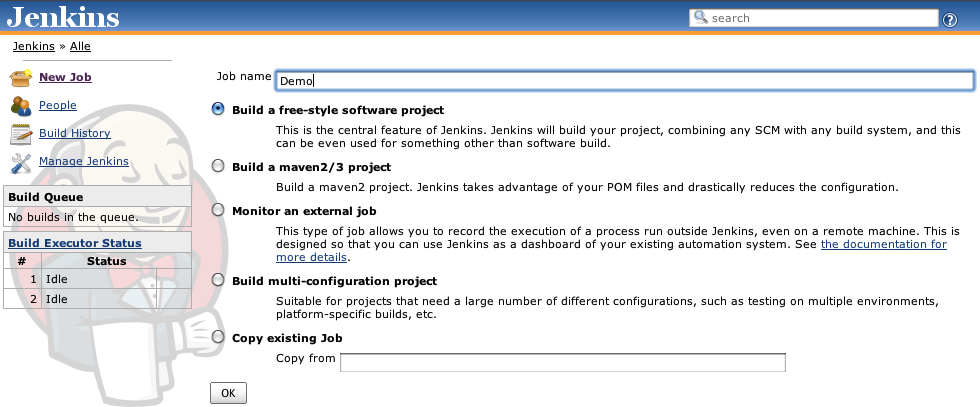

#Continuous Integration for Gitflow and Semver  

Now that your project has been setup with a branching model and a versioning system, the next topic deals with automatically building and distributing the different branches and versions to team members. The sooner that quality engineers (QA), business analysts (BA) and product managers (PM) can get their hands on the latest version of the software, the faster that developers can get feedback on their work. [Continuous Integration](https://en.wikipedia.org/wiki/Continuous_integration) is a process that fulfills this need.  

There are many Continuous Integration options available on the market but this presentation will focus on [Jenkins](https://jenkins-ci.org), a powerful and time-tested Continuous Integration system [very popular](https://wiki.jenkins-ci.org/pages/viewpage.action?pageId=58001258) in the Software Engineering industry and the open-source community.  

The project has been around since 2004 when it was developed by Sun Microsystems under the name Hudson and by way of a trademark dispute became known to the open-source community as Jenkins. Out-of-the-box Jenkins supports Subversion and CVS, and since Jenkins is extensible, there is a plugin to add [support for Git SCM](https://wiki.jenkins-ci.org/display/JENKINS/Git+Plugin).  

###Jenkins Jobs  
A 'job' in Jenkins is the basic unit of continuous integration. A job can be used to build and/or merge multiple branches simultaneously.  

  

###Permanent Branches  

####Develop
We will create one job specifically for the develop branch.

####Master  
In the context of iOS Development, a Job for the master branch is not entirely necessary. This is because a release build needs to be submitted for App Store Review *and* approved before the release branch is merged into master. By the time that a Master job builds the lastest commit, the release build is already being used by customers. However, it may also be good practice to perform sanity checks to confirm that what the release branch merge-commit on the master branch contains is indeed what has been released to the App Store.  

###Supporting Branches  
Now that the first Job for the project Git repository has been configured, it is easy to start creating more jobs for each branch. Instead of configuring additional jobs from scratch, the first job can be cloned and modified so that we only have to modify what we need.  

####Release  

####Feature  

####Hotfix  

##References  

[Jenkins: An extensible open source continuous integration server]http://jenkins-ci.org)  

**Previous**: [Semantic Versioning](semantic-versioning.md)  
Return to the [homepage](README.md).
